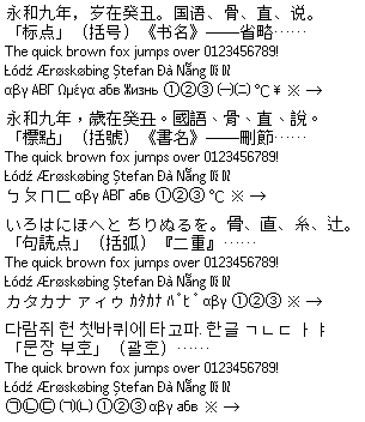

# Tong Pixel Sans · 通格像素黑体

**English** · [中文](README.zh.md)

A 14-pixel pan-CJK bitmap font with separate versions for Simplified Chinese, Traditional Chinese, Japanese and Korean, each available as a proportional and a monospace font.



## Features

- **Regional glyphs**: characters written differently in China, Taiwan, Japan and Korea (such as 骨, 直, 说) are drawn separately for each version, and punctuation sits where each region expects it.
- **Wide coverage**: about 30,000 characters per font, with complete coverage of GB/T 2312, the Table of General Standard Chinese Characters (通用规范汉字表), Big5, Taiwan's common and less-common standard characters, JIS X 0208 level 1, and all modern Hangul syllables. Also covers Bopomofo, kana, Latin (including Vietnamese), Greek, Cyrillic, Thai, Arabic, box drawing, block elements and Braille.
- **Clear at small sizes**: CJK characters use 13×13 pixels of ink with one-pixel strokes. Proportional Latin has one-pixel spacing and full descenders.
- **Terminal-friendly**: the monospace fonts use a dual width of 14 px (full width) and 7 px (half width), and box-drawing and block characters join seamlessly.

## Font files

| Files | Use |
|---|---|
| `TongPixelSansSC-14.bdf` `TongPixelSansTC-14.bdf` `TongPixelSansJP-14.bdf` `TongPixelSansKR-14.bdf` | Proportional (text, user interfaces) |
| `TongPixelSansMonoSC-14.bdf` … `TongPixelSansMonoKR-14.bdf` | Monospace (terminals, code) |

The family names are “Tong Pixel Sans SC”, “Tong Pixel Sans Mono SC” and so on. The fonts are currently available as BDF.

## Building from source

Only Python 3 is needed; nothing else has to be installed:

```bash
python3 tools/build.py      # writes the 8 BDF files to build/
python3 tools/verify.py     # checks the sources and character coverage
```

## Status

**This is a draft.** The glyphs were first rasterised from Source Han Sans and other fonts, then retouched character by character by AI. About 700 characters have been reviewed by hand so far; the rest still await review. Feedback is welcome.

## Contributing

Every glyph is a plain-text bitmap under `glyphs/`. You can edit it directly or use the built-in web editor (`python3 tools/editor/server.py`). The documentation (in Chinese) is in [docs/](docs/README.md).

## License

[SIL Open Font License 1.1](OFL.txt). The bitmaps are drawn after Source Han Sans, Source Sans 3, Noto Sans, Noto Sans Thai, Noto Sans Arabic, Noto Sans Math, Noto Sans Symbols and Noto Sans Symbols 2, with the Han characters Source Han Sans lacks drawn after [Plangothic](https://github.com/Fitzgerald-Porthmouth-Koenigsegg/Plangothic_Project) P1, and part of the Han bitmaps draw on [TUMBLED](https://github.com/TsFreddie/TUMBLED) by TsFreddie; all are released under the OFL, and their license texts are in [licenses/](licenses/).
